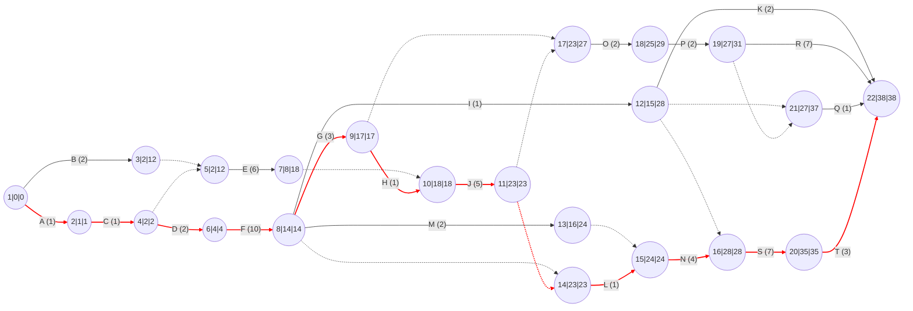

```mermaid
flowchart LR
    %% --- Definición de Nodos ---
    N1(("1|0|0"))
    N2(("2|1|1"))
    N3(("3|2|12"))
    N4(("4|2|2"))
    N5(("5|2|12"))
    N6(("6|4|4"))
    N7(("7|8|18"))
    N8(("8|14|14"))
    N9(("9|17|17"))
    N10(("10|18|18"))
    N11(("11|23|23"))
    N12(("12|15|28"))
    N13(("13|16|24"))
    N14(("14|23|23"))
    N15(("15|24|24"))
    N16(("16|28|28"))
    N17(("17|23|27"))
    N18(("18|25|29"))
    N19(("19|27|31"))
    N20(("20|35|35"))
    N21(("21|27|37"))
    N22(("22|38|38"))

    %% --- Conexiones y Actividades ---
    N1 -- A (1) --> N2
    N1 -- B (2) --> N3
    N2 -- C (1) --> N4
    N3 -.-> N5
    N4 -- D (2) --> N6
    N4 -.-> N5
    N5 -- E (6) --> N7
    N6 -- F (10) --> N8
    N7 -.-> N10
    N8 -- G (3) --> N9
    N8 -- I (1) --> N12
    N8 -- M (2) --> N13
    N8 -.-> N14
    N9 -- H (1) --> N10
    N9 -.-> N17
    N10 -- J (5) --> N11
    N11 -.-> N14
    N11 -.-> N17
    N12 -- K (2) --> N22
    N12 -.-> N16
    N12 -.-> N21
    N13 -.-> N15
    N14 -- L (1) --> N15
    N15 -- N (4) --> N16
    N17 -- O (2) --> N18
    N18 -- P (2) --> N19
    N19 -- R (7) --> N22
    N19 -.-> N21
    N21 -- Q (1) --> N22
    N16 -- S (7) --> N20
    N20 -- T (3) --> N22

    %% --- Resaltado de la Ruta Crítica ---
    linkStyle 0 stroke:red,stroke-width:2px
    linkStyle 2 stroke:red,stroke-width:2px
    linkStyle 4 stroke:red,stroke-width:2px
    linkStyle 7 stroke:red,stroke-width:2px
    linkStyle 9 stroke:red,stroke-width:2px
    linkStyle 13 stroke:red,stroke-width:2px
    linkStyle 15 stroke:red,stroke-width:2px
    linkStyle 16 stroke:red,stroke-width:2px
    linkStyle 22 stroke:red,stroke-width:2px
    linkStyle 23 stroke:red,stroke-width:2px
    linkStyle 29 stroke:red,stroke-width:2px
    linkStyle 30 stroke:red,stroke-width:2px
```
