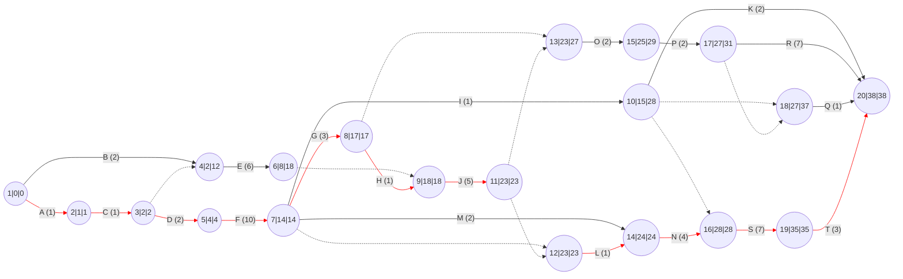

```mermaid
flowchart LR
    %% --- Definición de Nodos ---
    N1(("1|0|0"))
    N2(("2|1|1"))
    N3(("3|2|2"))
    N4(("4|2|12"))
    N5(("5|4|4"))
    N6(("6|8|18"))
    N7(("7|14|14"))
    N8(("8|17|17"))
    N9(("9|18|18"))
    N10(("10|15|28"))
    N11(("11|23|23"))
    N12(("12|23|23"))
    N13(("13|23|27"))
    N14(("14|24|24"))
    N15(("15|25|29"))
    N16(("16|28|28"))
    N17(("17|27|31"))
    N18(("18|27|37"))
    N19(("19|35|35"))
    N20(("20|38|38"))

    %% --- Conexiones y Actividades ---
    N1 -- A (1) --> N2
    N1 -- B (2) --> N4
    N2 -- C (1) --> N3
    N3 -- D (2) --> N5
    N3 -.-> N4
    N4 -- E (6) --> N6
    N5 -- F (10) --> N7
    N6 -.-> N9
    N7 -- G (3) --> N8
    N7 -- I (1) --> N10
    N7 -- M (2) --> N14
    N7 -.-> N12
    N8 -- H (1) --> N9
    N8 -.-> N13
    N9 -- J (5) --> N11
    N10 -- K (2) --> N20
    N10 -.-> N16
    N10 -.-> N18
    N11 -.-> N12
    N11 -.-> N13
    N12 -- L (1) --> N14
    N13 -- O (2) --> N15
    N14 -- N (4) --> N16
    N15 -- P (2) --> N17
    N16 -- S (7) --> N19
    N17 -- R (7) --> N20
    N17 -.-> N18
    N18 -- Q (1) --> N20
    N19 -- T (3) --> N20

    %% --- Resaltado de la Ruta Crítica ---
    linkStyle 0 stroke:red,stroke-width:2px  %% A
    linkStyle 2 stroke:red,stroke-width:2px  %% C
    linkStyle 3 stroke:red,stroke-width:2px  %% D
    linkStyle 6 stroke:red,stroke-width:2px  %% F
    linkStyle 8 stroke:red,stroke-width:2px  %% G
    linkStyle 12 stroke:red,stroke-width:2px %% H
    linkStyle 14 stroke:red,stroke-width:2px %% J
    linkStyle 20 stroke:red,stroke-width:2px %% L
    linkStyle 22 stroke:red,stroke-width:2px %% N
    linkStyle 24 stroke:red,stroke-width:2px %% S
    linkStyle 28 stroke:red,stroke-width:2px %% T
```
